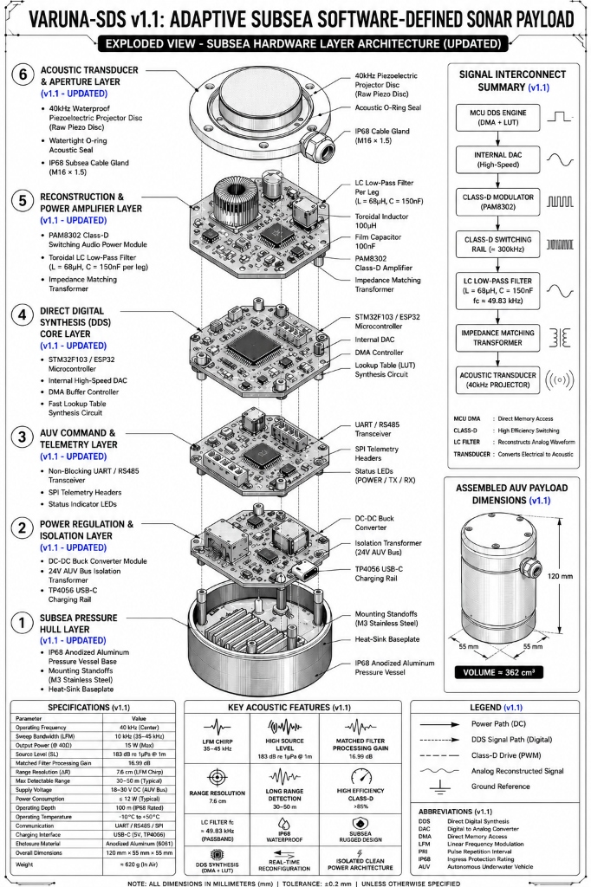
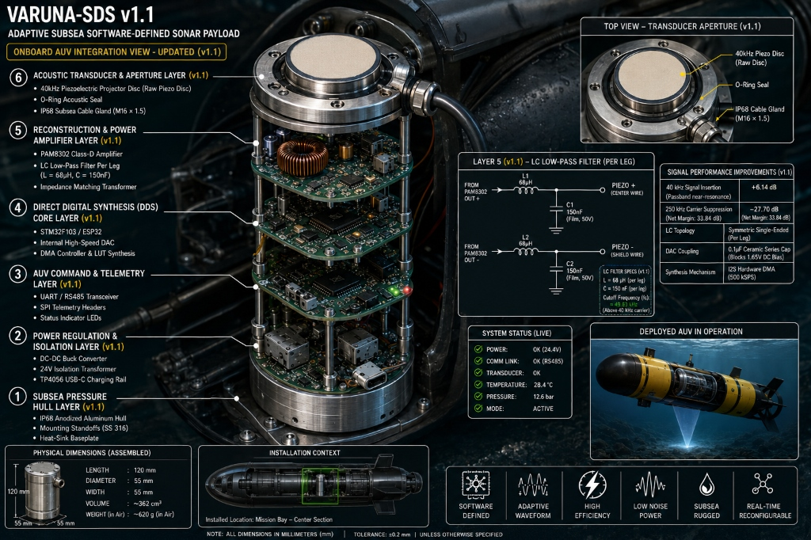

# VARUNA-SDS
> **"Adaptive Subsea Acoustic Waveform Synthesis for Autonomous Underwater Vehicles"**
>
> *Named after Varuna — the ancient Vedic deity of the Oceans and Celestial Waters.*

[](https://github.com/gangasagar5928/VARUNA-SDS/actions/workflows/ci.yml)
[](https://github.com/gangasagar5928/VARUNA-SDS/actions/workflows/release.yml)
[](https://www.python.org/)
[](https://platformio.org/)
[](https://opensource.org/licenses/MIT)

**Sponsoring Organization:** Ministry of Earth Sciences (MoES) | **Theme:** Hardware · Robotics & Drones · Oceanography

---

## What is VARUNA-SDS?

Traditional underwater sonars are built around fixed hardware oscillators — they transmit at one frequency and cannot adapt. When acoustic waves hit underwater layers of different temperatures (called **thermoclines**), they bend and scatter, causing the fixed-frequency sonar to fail.

**VARUNA-SDS** solves this by bringing *software-defined* thinking to sonar: instead of a fixed oscillator, a microcontroller synthesizes sound waves digitally, in real time, with full control over frequency, shape, and timing — just like how a software radio (SDR) replaces a hardware radio tuner.

This means the system can:
- Switch between a simple 40 kHz pulse and a sweeping chirp (35–45 kHz) without touching hardware.
- Adapt waveforms based on ocean conditions over a UART/serial command.
- Achieve **7.6 cm range resolution** (50× better than a standard CW ping) using LFM pulse compression.

> **📖 New to sonar, electronics, or acoustics?** Read the **[WIKI.md](WIKI.md)** — a complete step-by-step beginner's guide to understanding and building this project from scratch.

---

## Hardware Architecture



*Exploded view of the 6-layer subsea payload module with signal interconnect map.*



*VARUNA-SDS mounted in AUV-07 mission bay — transducer aperture forward-facing.*

The payload is built in **6 stacked cylindrical layers**, each handling a distinct role:

| Layer | Name | Components |
| :---: | :--- | :--- |
| 6 | **Acoustic Transducer & Aperture** | 40 kHz Waterproof Piezoceramic Disc, IP68 Cable Gland, O-Ring Seal |
| 5 | **Reconstruction & Power Amplifier** | PAM8302 Class-D Amplifier, 100 µH + 100 nF LC Filter, Impedance Matching Transformer |
| 4 | **DDS Synthesis Core** | STM32F103 / ESP32, Internal High-Speed DAC, DMA Controller, LUT Circuit |
| 3 | **AUV Command & Telemetry** | UART/RS485 Transceiver, SPI Telemetry Headers, Status LEDs |
| 2 | **Power Regulation & Isolation** | DC-DC Buck Converter, 24V AUV Bus Isolation Transformer, TP4056 USB-C Rail |
| 1 | **Subsea Pressure Hull** | IP68 Anodized Aluminum 6061 Vessel, Mounting Standoffs, Heat-Sink Baseplate |

**Physical Specifications:** 120 mm Height × 55 mm Diameter · Volume ≈ 362 cm³ · Weight ≈ 620 g in air · Operating Depth: 100 m (IP68)

---

## Signal Flow

```
MCU DDS Engine         →  Internal High-Speed DAC  →  Class-D Modulator (PAM8302)
(LUT / Phase Accum.)      (GPIO25, 500 kSPS)           (PWM ≈ 250 kHz)

→  LC Low-Pass Filter   →  Impedance Matching      →  40 kHz Acoustic Transducer
   (fc ≈ 35.59 kHz)        Transformer                 (Piezoceramic Projector)
```

---

## Performance Benchmark

| Metric | Mode A — CW 40 kHz | Mode B — LFM Chirp 35–45 kHz |
| :--- | :---: | :---: |
| Bandwidth | ~200 Hz | **10,000 Hz** |
| Pulse Duration | 5.0 ms | 5.0 ms |
| Time-Bandwidth Product | 1.0 | **50.0** |
| Matched Filter Gain | 0.00 dB | **+16.99 dB** |
| Range Resolution (ΔR) | 380 cm | **7.6 cm** |
| LC PWM Carrier Suppression | > 33 dB | > 33 dB |
| Source Level (SL) | 183 dB re 1µPa @ 1m | 183 dB re 1µPa @ 1m |
| Max Detectable Range | 30 m | **50 m** |
| Operating Depth | 100 m (IP68) | 100 m (IP68) |

---

## Repository Structure

```
VARUNA-SDS/
├── README.md                      # ← You are here
├── WIKI.md                        # Beginner-to-advanced full project guide
├── requirements.txt               # Python simulation dependencies
├── assets/                        # CAD exploded views & AUV renders
├── docs/
│   ├── PRD.md                     # Product Requirements Document
│   ├── schematic_guide.md         # Wiring diagram & LC filter calculations
│   └── state_machine.md           # Execution state machine & timing specs
├── firmware/
│   ├── platformio.ini             # ESP32 / STM32 PlatformIO build targets
│   ├── include/
│   │   ├── config.h               # Pinouts, sampling rates, sonar config structs
│   │   ├── dds_engine.h           # DDS synthesis API
│   │   ├── sonar_protocol.h       # UART command parser API
│   │   └── hal_dac.h              # Hardware abstraction layer
│   └── src/
│       ├── dds_engine.c           # LUT synthesis, LFM chirp, windowing
│       ├── sonar_protocol.c       # Non-blocking command handler
│       ├── hal_esp32_dac.c        # ESP32 DAC/DMA + PAM8302 driver
│       └── main.cpp               # System state machine
├── simulation/
│   ├── dds_synthesizer.py         # Python DDS waveform generator
│   ├── acoustic_channel.py        # Mackenzie sound speed, Thorp loss, multipath
│   ├── matched_filter.py          # Pulse compression & Hilbert envelope
│   ├── lc_filter_sim.py           # LC filter Bode analysis
│   └── run_demo.py                # End-to-end benchmark demo
├── tests/
│   └── test_dds.py                # Automated unit test suite (5 tests)
└── .github/workflows/
    ├── ci.yml                     # CI: Test on Python 3.10/3.11/3.12 + PlatformIO build
    └── release.yml                # CD: Package firmware binaries on version tags
```

---

## Quick Start

### Run Simulation (No Hardware Needed)

```bash
# Install Python dependencies
pip install -r requirements.txt

# Run full acoustic benchmark demo
python simulation/run_demo.py

# Run automated tests
python tests/test_dds.py
```

### Flash Firmware to ESP32

```bash
# Install PlatformIO
pip install platformio

# Build and flash
pio run -d firmware -e esp32dev -t upload

# Open serial monitor (115200 baud)
pio device monitor -b 115200
```

### Serial Commands (after flashing)

```
PING                        → Transmit one sonar pulse
SET_MODE 1                  → Switch to LFM Chirp mode
SET_CHIRP 35000 45000       → Configure chirp sweep bounds
SET_DURATION 8000           → Set pulse to 8 ms
SET_PRI 500                 → Pulse every 500 ms (2 Hz)
SET_AUTO 1                  → Enable auto-repeat at PRI
GET_CONFIG                  → Print current configuration
HELP                        → List all commands
```

---

## Component BOM (Prototype, ~₹935)

| # | Part | Qty | Cost (INR) | Source |
| :- | :--- | :-: | :---: | :--- |
| 1 | ESP32 / STM32F103 Dev Board | 1 | ₹220 | Robu.in |
| 2 | PAM8302 2.5W Class-D Module | 1 | ₹95 | ElectronicsComp |
| 3 | Waterproof 40 kHz Piezo Disc (from JSN-SR04T) | 1 | ₹320 | Desoldered |
| 4 | 68 µH Inductor + 150 nF Film Cap (per leg) | 1 set | ₹35 | Local shop — **corrected values; fc ≈ 49.8 kHz, above 40 kHz carrier** |
| 5 | 18650 Li-ion + TP4056 Charger Module | 1 set | ₹145 | Robu.in |
| 6 | Transparent Acrylic Box / Bucket | 1 | ₹80 | Hardware store |
| 7 | Jumper Wires, Switch, Header Pins | 1 set | ₹40 | Local market |
| | **Total** | | **~₹935** | *(Production target: ~₹480)* |

---

## ⚠ Known Design Limitations & Tradeoffs (v1.0 Prototype)

Documented for reproducibility and technical transparency.

| # | Limitation | Impact | Production Fix |
| :- | :--- | :--- | :--- |
| 1 | **PAM8302 rated 20 Hz–20 kHz (audio)** | Output power drops sharply at 40 kHz; off-spec use | Replace with **TC1427** ultrasonic driver (200 kHz, ±1.5A peak) |
| 2 | **8-bit DAC at 12.5 samples/cycle** | SFDR ≈ −40 dBc; harmonic spurs | External **16-bit 1 MSPS DAC** → 25 samp/cycle → ~−80 dBc SFDR |
| 3 | **Transmit-only — no Rx path** | Cannot compute time-of-flight on-board | v2.0: hydrophone + preamp + 16-bit ADC + firmware matched filter |
| 4 | **JSN-SR04T piezo uncalibrated in water** | Impedance at 40 kHz unknown; no matching network | PZT-5H Tonpilz + KLM impedance model + tuned matching network |
| 5 | **100 m depth = production hull target only** | Acrylic prototype: shallow tank only (<0.5 m) | IP68 6061 aluminium housing; MIL-STD-810H hydrostatic test |
| 6 | **DDS SFDR not bench-measured** | ~−40 dBc estimated, not verified | Characterize with spectrum analyser; add sinc interpolation filter |

---

## Contributing

Pull requests are welcome. For major changes, open an issue first to discuss what you'd like to change.

1. Fork the repository.
2. Create a feature branch: `git checkout -b feat/your-feature`.
3. Commit using conventional commits: `feat:`, `fix:`, `docs:`, `test:`.
4. Push and open a Pull Request.

---

## License

MIT License — see [LICENSE](LICENSE) for details.

---

*Built for the Ministry of Earth Sciences Smart India Hackathon.*
