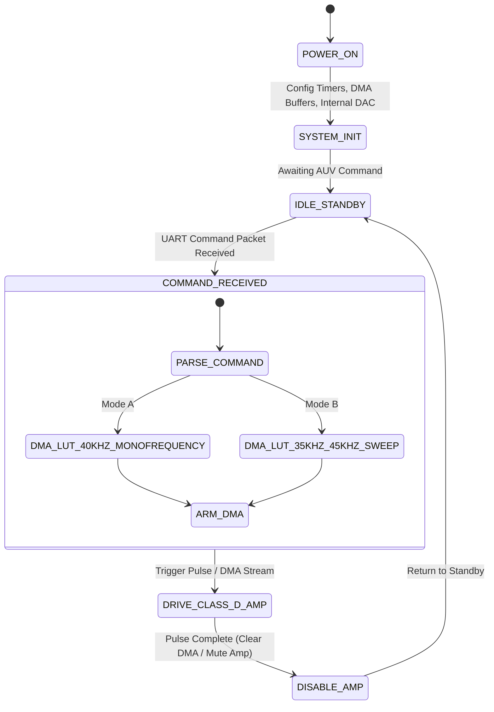

# VARUNA-SDS: Software-Defined Sonar Payload
> **"Adaptive Subsea Acoustic Waveform Synthesis for Autonomous Underwater Vehicles"**  
> *Named after Varuna, the ancient Vedic deity of the Oceans and Celestial Waters + Software-Defined Sonar.*

## Product Requirements Document (PRD)

**Sponsoring Organization:** Ministry of Earth Sciences (MoES)  
**Category / Theme:** Hardware | Robotics and Drones / Oceanography  

---

## 1. Core Objective
Conventional active sonars rely on fixed-frequency hardware oscillators that fail when encountering underwater thermoclines, temperature stratification, and multipath acoustic fading. **VARUNA-SDS** applies Software-Defined Radio (SDR) principles to underwater acoustics, utilizing Direct Digital Synthesis (DDS) via DMA to dynamically synthesize complex acoustic waveforms (CW Pings, Linear Frequency Modulation [LFM] Chirps) in real time while driving piezoceramic transducers via a high-efficiency Class-D amplifier.

---

## 2. System Architecture & Component Mapping

| Module | Prototype Part (Budget) | Production Component (Industrial Scale) | Function / Purpose |
| :--- | :--- | :--- | :--- |
| **Compute & Synthesis Core** | STM32F103C8T6 (Blue Pill) / ESP32 | Xilinx Zynq-7000 / Spartan-7 FPGA | DDS Waveform Synthesis & High-Speed DMA Buffer Management |
| **DAC Synthesizer** | Internal MCU DAC (>500 kSPS via DMA) | 16-bit 1 MSPS Parallel Dual DAC | Direct reconstruction of analog acoustic sine/chirp waveforms |
| **Power Stage** | PAM8302 2.5W Single-Channel Class-D Module | High-Efficiency Class-D / Class-H Switching Bridge | Driving reactive acoustic transducer loads with >85% efficiency |
| **Acoustic Transducer** | Bare 40kHz Piezoelectric Disc (Desoldered) | PZT-5H Tonpilz / Barrel-Stave Projector Element | Translating drive signals into acoustic pressure waves |
| **Power Supply** | 3.7V 18650 Li-ion Cell + TP4056 + Buck Converter | AUV 24V Main Bus + DC-DC Isolation Module | Regulated low-noise power rail for digital and analog stages |

> **Note on Transducer Selection:** Packaged JSN-SR04T ultrasonic modules expose a digital trigger/echo microcontroller interface that blocks arbitrary analog waveform driving. The bare piezoelectric transducer element must be desoldered and driven directly to accept custom DDS analog synthesis.

---

## 3. Functional Requirements

- **FR-1 (DDS Engine):** Synthesize acoustic waveforms using internal DMA-driven look-up tables (LUT).
  - Mode A: Monofrequency CW Pings (40 kHz).
  - Mode B: Linear Frequency Modulation (LFM) Chirps (35 kHz -> 45 kHz sweep for narrow-band student discs; 20 kHz -> 60 kHz for production broadband Tonpilz projectors).
- **FR-2 (Dynamic Reconfiguration):** Real-time parameter updates over UART/SPI (Frequency, Sweep Bandwidth, Pulse Repetition Interval [PRI], Pulse Width) without firmware reboots.
- **FR-3 (High-Efficiency Driver):** Class-D switching topology maintaining >80% power conversion efficiency with an LC reconstruction filter smoothing PWM outputs into clean sinusoidal signals.
- **FR-4 (Pulse Shaping & Windowing):** Apply windowing (Tukey, Hann) to eliminate transient spectral splatter and transducer ringing.

---

## 4. Execution State Machine

---

## 5. Prototype BOM

| # | Component Description | Specific Part / Model | Qty | Prototype Cost (INR ₹) | Sourcing / Engineering Note |
| :- | :--- | :--- | :- | :--- | :--- |
| 1 | Compute & Synthesis Core | STM32F103C8T6 / ESP32 Dev Board | 1 | ₹220 | Robu.in (DMA + Internal High-Speed DAC) |
| 2 | Acoustic Power Amplifier | PAM8302 2.5W Class-D Module | 1 | ₹95 | ElectronicsComp (>85% PAE efficiency) |
| 3 | Bare Acoustic Transducer | Waterproof Piezo Disc (40 kHz) | 1 | ₹320 | Desoldered from JSN-SR04T probe |
| 4 | LC Reconstruction Filter | 68 µH Inductor + 150 nF Film Cap (per leg) | 1 set | ₹35 | Local Shop — **68 µH + 150 nF → fc ≈ 49.8 kHz, above 40 kHz carrier** |
| 5 | Power Subsystem | 18650 Li-ion Cell + TP4056 Charger | 1 set | ₹145 | Robu.in / Local Market |
| 6 | Water Isolation Container | Transparent Acrylic Box / Bucket | 1 | ₹80 | Local Hardware Store (Water test setup) |
| 7 | Interconnects & Accessories | Jumper Wires, Switch, Header Pins | 1 set | ₹40 | Local Market |
| **TOTAL** | **VARUNA-SDS Payload** | **Complete Working Transmitter** | — | **~ ₹935** | *(Mass Production Target: ~₹480 / $5.80 USD)* |
